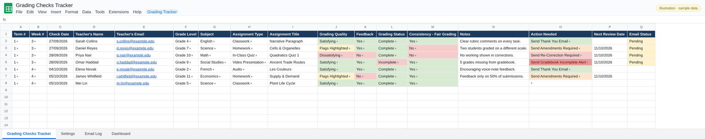
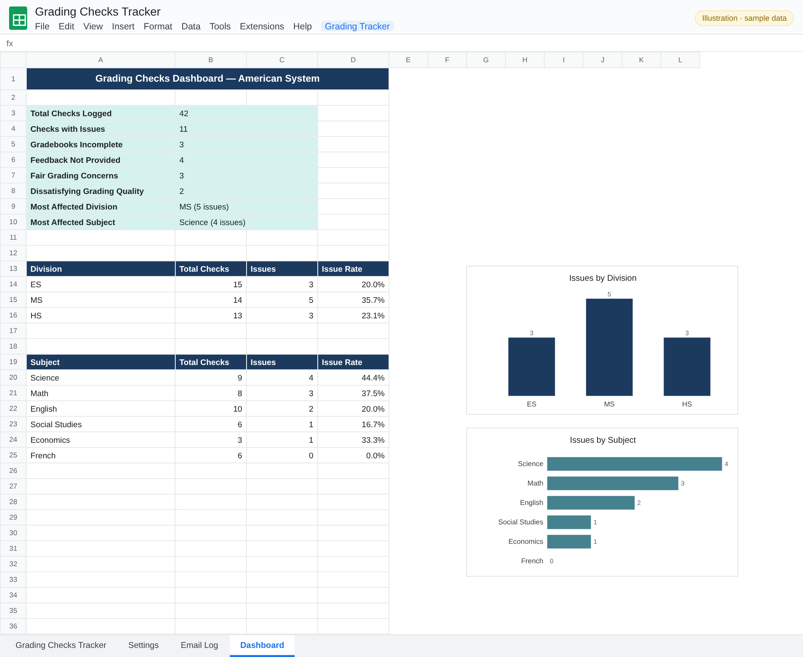

# Grading Checks Tracker


A Google Sheets tool for academic leaders who check teachers' grading quality. You log each check in one row, pick an action, and the script sends the right follow-up email to the teacher. It CCs the correct principals, directors and Heads of Department automatically, logs every send, and keeps a live dashboard of grading quality across the school.

Works for **American** (Grades 1–12, ES / MS / HS) and **British** (Years 1–9, Primary / Key Stage 3) school systems. You switch between them with one setting.

---

## Screenshots

> Illustrations of the sheets this script builds, filled with **fictional sample data**. No real school, staff or student data is included.

**Tracker tab: one row per grading check, color-coded quality and action dropdowns**



**Dashboard tab: KPIs, issue rates by division and subject, auto-built charts**



## Features

- **One-click setup** builds the Tracker, Settings, Email Log and Dashboard tabs with headers, dropdowns, colors and frozen rows.
- **Structured check log**: term, week, teacher, grade/year level, subject, assignment type, grading quality, feedback, consistency, notes and next review date.
- **Four action emails** chosen from a dropdown:
  - Thank You
  - Amendments Required
  - Re-Correction Required
  - Gradebook Incomplete Alert
- **Smart CC routing**: contacts in the Settings tab are CC'd when their division matches the teacher's grade level. Heads of Department are CC'd only for their own subject.
- **Role limits and validation**: for example, a maximum of 3 principals and 1 campus director. Settings errors are flagged as you type.
- **CC preview** for any selected row before sending.
- **Status tracking**: a row switches to *Pending* as soon as an action is chosen. After a successful send it moves to the Email Log, so the tracker shows only open items and nothing is sent twice.
- **Email Log**: a full record of each email, with its CC recipients and send date.
- **Dashboard** with KPIs and charts: total checks, plus issue rates by division and by subject, highlighting where follow-up is most needed.

## Choosing a school system

At the top of `src/Code.gs`:

```js
var SCHOOL_SYSTEM = "AMERICAN"; // "AMERICAN" | "BRITISH"
```

Each preset in `SYSTEM_PRESETS` defines the level labels, subjects, divisions (with grade ranges) and whether a Vice Principal role is used. To support another system, add your own preset.

## Setup

1. Create a new Google Sheet.
2. Open **Extensions → Apps Script** and paste in `src/Code.gs`. Optionally, replace `appsscript.json` with the one in `src/`; it shows hidden in the editor settings.
3. Set `SCHOOL_SYSTEM`, then save.
4. Reload the sheet and run **Grading Tracker → Set Up Tracker (run once)**.
5. Fill in the **Settings** tab with the names and emails of the people to CC, and mark each one *Active* or *Inactive*.
6. Log grading checks in the **Grading Checks Tracker** tab. Choose an *Action Needed*, then run **Grading Tracker → Send Action Emails**.

### With clasp

```bash
npm install -g @google/clasp
clasp login
cp .clasp.json.example .clasp.json   # paste your script ID
clasp push
```

## Menu

| Item | What it does |
|---|---|
| Set Up Tracker (run once) | Builds all tabs |
| Set Up / Repair Settings Tab | Rebuilds Settings formatting without losing contacts |
| Send Action Emails | Sends every pending action and moves sent rows to the Email Log |
| Preview CC List for Selected Row | Shows who will be CC'd |
| Refresh Dashboard | Recalculates KPIs and charts |

## Privacy

The repository contains **no names, emails or school data**. Everything is entered in your own spreadsheet.

## License

[MIT](LICENSE) © Randa ELGawish

## Author

**Randa ELGawish**, Academic leader and EdTech developer
[LinkedIn](https://www.linkedin.com/in/randaelgawishegy) · [GitHub](https://github.com/RandaELGawish93)
