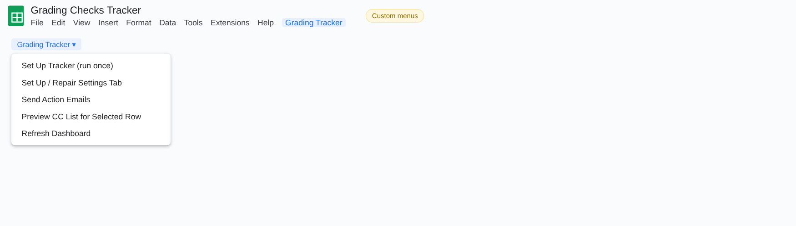
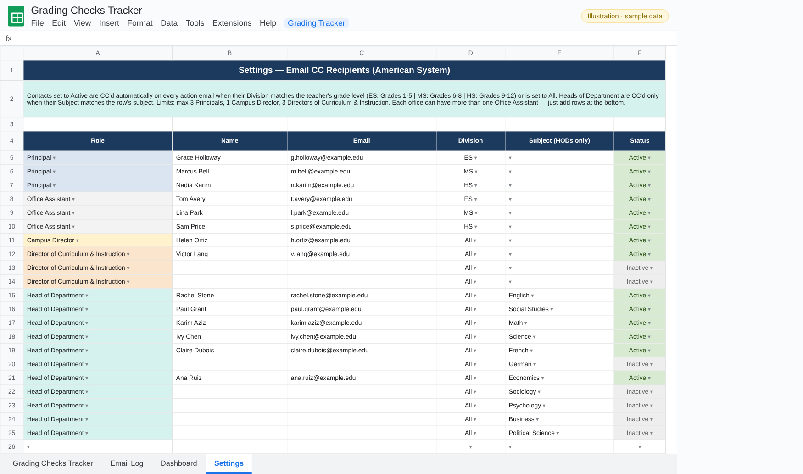
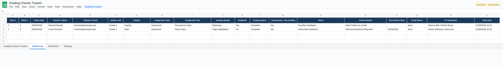
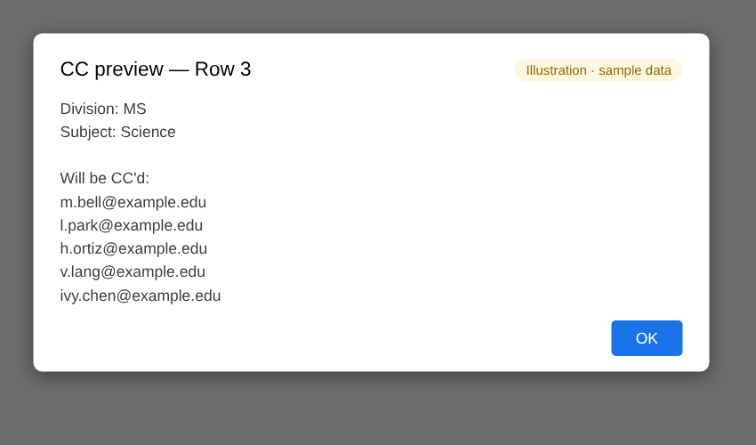
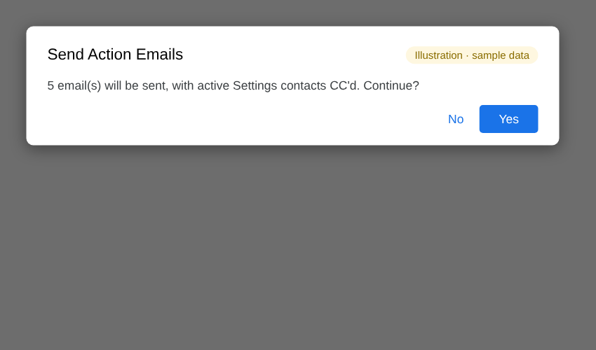
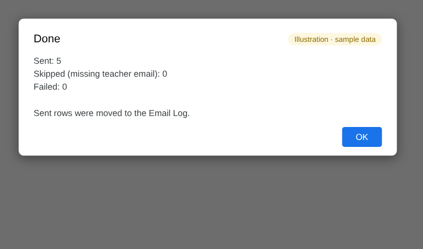
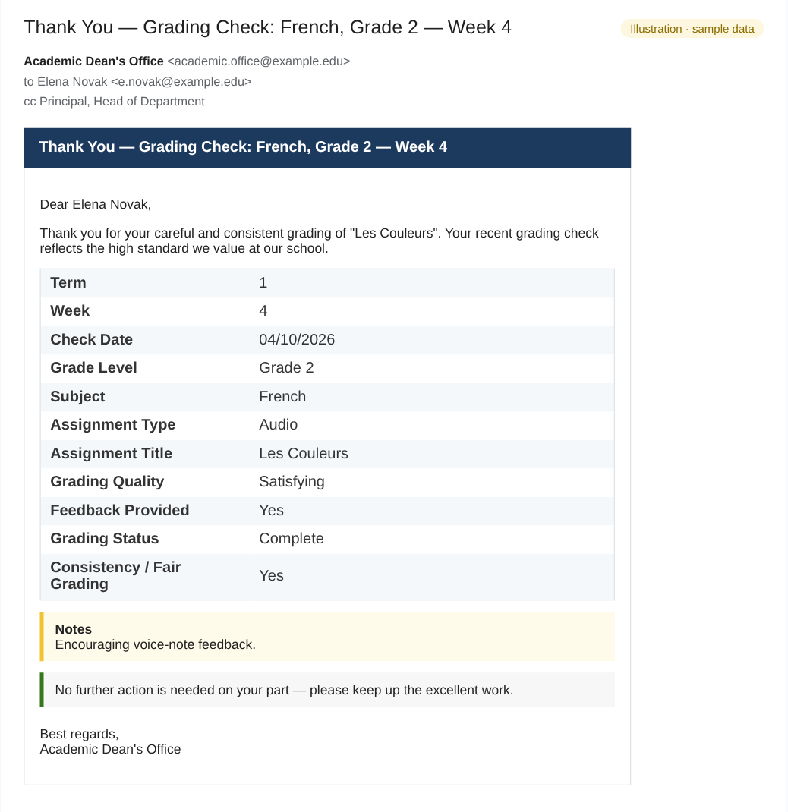
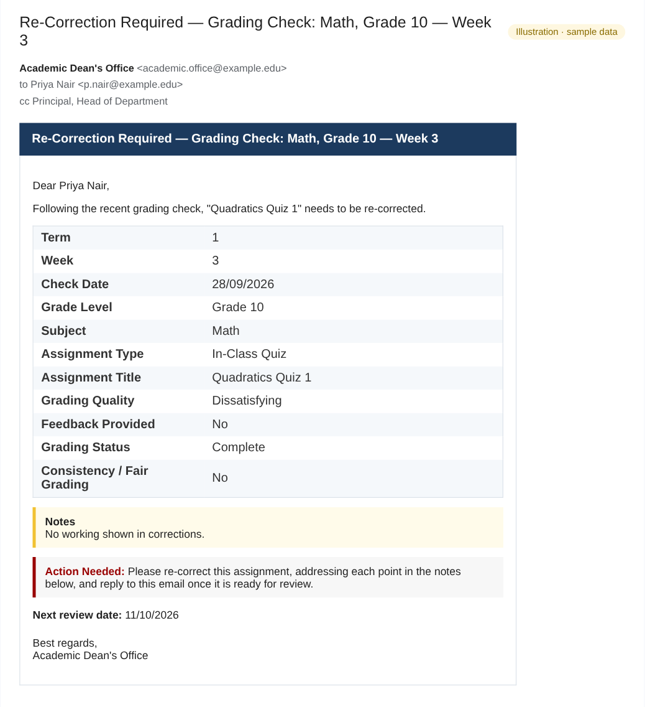
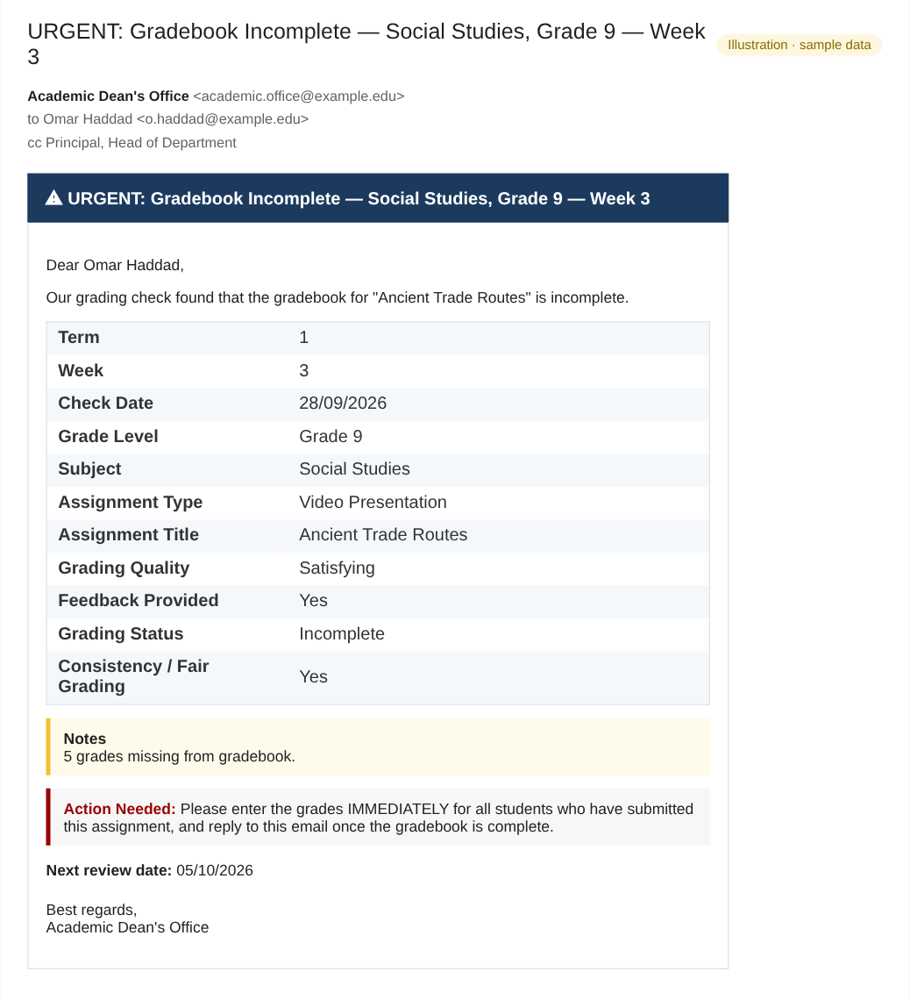

# Grading Checks Tracker: illustrated guide

How to log grading checks, choose follow-up actions and send the right email with the right people CC'd.

> Every picture in this guide is an **illustration filled with fictional sample data** (names like *Sarah Collins*, emails at `example.edu`). No real school, staff or student data appears anywhere in this repository.

## Contents

- [Menu](#menu)
- [Tabs](#tabs)
- [Sending emails](#sending-emails)
- [The four emails](#the-four-emails)

## Menu

### Grading Tracker menu

| Item | What it does |
|---|---|
| **Set Up Tracker (run once)** | Builds the Grading Checks Tracker, Settings, Email Log and Dashboard tabs with headers, dropdowns, colors and frozen rows. |
| **Set Up / Repair Settings Tab** | Rebuilds the Settings tab's layout and dropdowns without losing the contacts already entered. |
| **Send Action Emails** | Sends one email for every row whose *Action Needed* is filled in, then moves those rows to the Email Log. |
| **Preview CC List for Selected Row** | Shows who would be CC'd for the row your cursor is on, before you send anything. |
| **Refresh Dashboard** | Recalculates the KPIs and tables and redraws both charts. |

## Tabs

### Grading Checks Tracker

One row per grading check: term, week, check date, teacher and email, grade level, subject, assignment type and title, then the judgement columns (grading quality, feedback provided, grading status, consistency / fair grading) with color-coded dropdowns. Write any detail in **Notes**, choose an **Action Needed** and set a **Next Review Date**. As soon as an action is chosen, **Email Status** switches to *Pending* automatically.

### Settings (CC recipients)

Everyone who may be CC'd. A contact set to **Active** is CC'd when their **Division** matches the teacher's grade level (ES Grades 1–5, MS 6–8, HS 9–12) or is set to *All*. Heads of Department are CC'd only when their **Subject** matches the row. Role limits (for example a maximum of 3 principals) are checked as you type, and a warning toast appears if one is exceeded.

### Email Log

Rows that were sent successfully are moved here with the date sent and the full CC list, so the tracker only ever shows open items and nothing can be sent twice.

### Dashboard

KPIs (checks logged, checks with issues, gradebooks incomplete, missing feedback, fairness concerns, unsatisfying quality, and the most affected division and subject), an issue-rate table by division and by subject, and two charts built automatically.

## Sending emails

### CC preview

**Preview CC List for Selected Row** shows the division and subject the script detected and every address that will be CC'd.

### Step 1: confirm

**Send Action Emails** counts the pending rows and asks you to confirm.

### Step 2: summary

A summary shows how many emails were sent, skipped (for example a missing teacher email) or failed. Sent rows are moved to the Email Log.

## The four emails

Each email repeats the check details in a table, includes your notes and states clearly what the teacher needs to do.

### Thank You

Recognises careful, consistent grading. No action is needed from the teacher.

### Amendments Required

Asks the teacher to amend the grading of that assignment and reply once done.

### Re-Correction Required

The assignment must be re-corrected, addressing each point in the notes.

### Gradebook Incomplete (urgent)

Marked URGENT: the gradebook must be completed immediately for every student who submitted.

---

[← Back to the README](../README.md)
